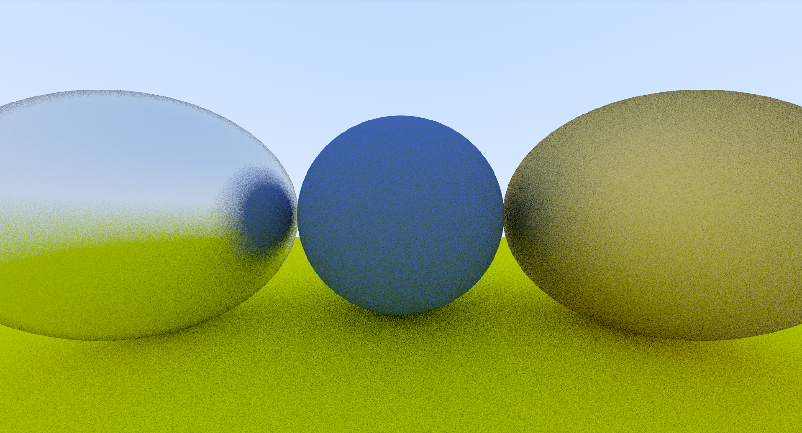

# Simple Raytracer in C++ using Opengl 

This project is a simple raytracer implemented in C++ with OpenGL, inspired by the Ray Tracing in One Weekend book series.

The raytracer works by first calculating and storing all pixel color values in a frame buffer, and then rendering the image using OpenGL on the CPU. This approach allows for real-time visualization while keeping the raytracing logic simple and easy to understand.

# Output 
### Rendered using Image width as 1920

